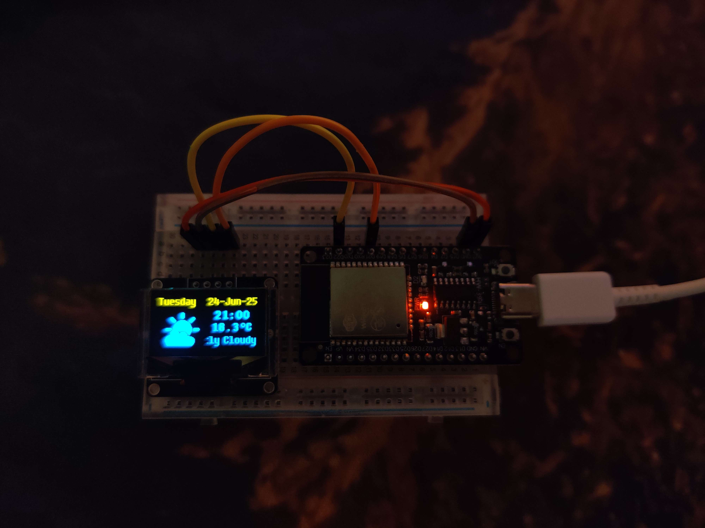

# Weather_App

A small application for the ESP32 HW-394 that utilizes a 128x64 SSD1306 OLED screen. 
The application displays the current date & weather information. 

Example of the weather app running on a ESP32. 
(Note that due to the brightness of the screen, the rest of the image has been darkened). 

# Usage
To use the project yourself:
- Download the dependencies mentioned in the credits below.
- Add a "network_defines.h" file in the include folder of the project.
	- Add an SSID define with the network SSID.
	- Add an PASS define with the network Password.
- Create your own [Open-meteo](https://open-meteo.com) URL.
	- Only 15-minute- temprature & weather code are supported as of now.
- Replace the Open-meteo URL in "network_control.h" at "m_WeatherURL".
	- Make sure the URL is HTTP and not HTTPS.
- Upload the project to the ESP32. 

# Credits
The weather information has been obtained thanks to the [Open-meteo API](https://open-meteo.com). 
The NTP time has been obtained thanks to the [NTP Pool Project](https://www.ntppool.org/en/). 
The weather icons have been made using [Aseprite](https://store.steampowered.com/app/431730/Aseprite/). 
The bitmaps of the weather icons were made using [image2cpp](https://javl.github.io/image2cpp/). 

## Dependencies
The project currently uses the following dependecies:
- u8g2 by Olikraus
- ArduinoJson by Benoit Blanchon

The project has been setup using [PlatformIO](https://platformio.org/) on [Visual Studio Code](https://code.visualstudio.com/).
